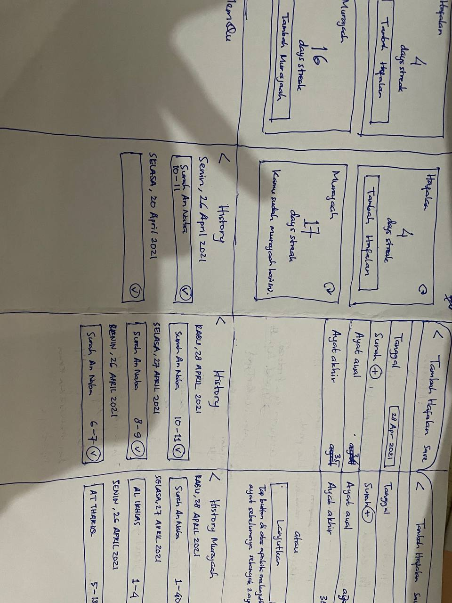

#Test

# Memqu
## Lo-Fi Prototype

## Hi-Fi Prototype
See [here](https://marvelapp.com/prototype/71ba6g2)

## Description
Setiap anak ingin selalu membalas kebaikan kedua orangtuanya.  Dengan berdoa, dengan memberi orang tua setiap bulan, atau dengan menghafal Al Quran. Saya ingin menjadi penghafal Al Quran agar  ketika di akhirat nanti saya bisa memberikan mahkota terbaik untuk orang tua saya.  Pertama kali saya menghafal Al Quran rasanya sulit sekali.  Bisa dibilang sangat pain. Apalagi murajaah.  Murajaah itu mengetes ulang hafalan Al Quran apakah masih bertahan atau tidak.  Kemudian saya mengikuti berbagai program tahfidz Al Quran.  Hal yang paling memorable adalah ketika setiap hari 1 pekan full centang ✅✅✅✅✅✅ semua 7/7 hari.  Sangat tidak disangka bisa konsisten juga ternyata.  Namun setelah selesai mengikuti program tersebut tidak terjaga konsistensinya.  Akhirnya saya turunkan target hafalan Quran harian saya jadi 2 ayat per hari.  

### Aplikasi MemQu (Memorizing Quran) diharapkan dapat membantu muslim/ah  dalam menambah dan menjaga hafalan Al Quran.

